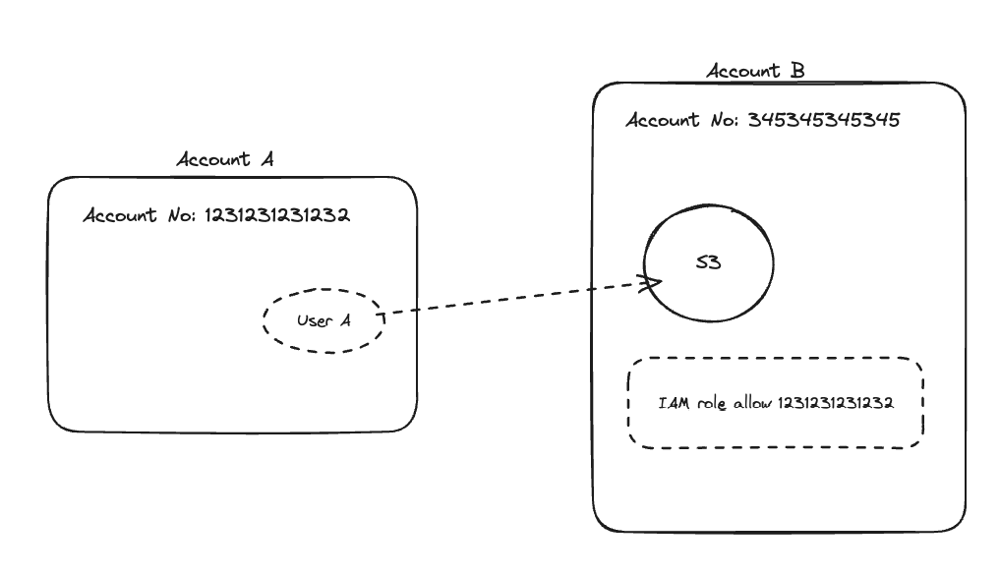

# aws_cli_cross_Account_assume_role
The steps below desribes the procedure to allow access to a user in Account A to access an S3 bucket in Account B using AWS CLI.

## Use case diagram


## Steps
1) Create a trust role in Account B to provide access to any user in Account A
* Use the below trust policy to create the IAM Role in Account B and add the principal as the Account A account ID
```
{
    "Version": "2012-10-17",
    "Statement": [
        {
            "Effect": "Allow",
            "Principal": {
                "AWS": "arn:aws:iam::12312321231232:root"
            },
            "Action": "sts:AssumeRole",
            "Condition": {}
        }
    ]
}
```
* The role arn for above role is: arn:aws:iam::345345345345:role/accounta
* You can follow the link for steps to create an IAM role: https://docs.aws.amazon.com/IAM/latest/UserGuide/id_roles_create_for-user.html#roles-creatingrole-user-console
2) Create an IAM policy and attach it to the trust IAM role
* Use the below policy to provide full access to S3.
```
{
  "Version": "2012-10-17",
  "Statement": [
      {
          "Effect": "Allow",
          "Action": [
              "s3:*"
          ],
          "Resource": "*"
      }
  ]
}
```
3) Configure AWS CLI
* Create a aws profile account-a in aws credential file ~/.aws/creadentials
```
[account-a]
aws_access_key_id = xxxxxxxxxxxxx
aws_secret_access_key = yyyyyyyyyyyyyyyyyyy
```
* Create a aws profile account-b in aws config file ~/.aws/config
```
[profile accountb]
role_arn = arn:aws:iam::345345345345:role/accounta
source_profile = accounta
```
* IN the above profile we are assuming the Account B role arn:aws:iam::345345345345:role/accounta through the source profile accounta. Since we have provided the Account A credentials in account credentials file Account A user will assume the role arn:aws:iam::345345345345:role/accounta and access the Account B s3 resource. Since the role arn:aws:iam::345345345345:role/accounta has provided access to Account A ID this request from Account A to B will succeed.     
4) Test run and check if the assume role is account b role.
```
$ aws sts get-caller-identity --profile accountb
{
    "UserId": "DDJFSDJFLKSDJFLKJS:botocore-session-1727844277",
    "Account": "345345345345",
    "Arn": "arn:aws:sts::345345345345:assumed-role/accounta/botocore-session-1727844277"
}
```
* The assume role output shows that the user has assumed the role of Account B without providing any credential for Account B.
* 
